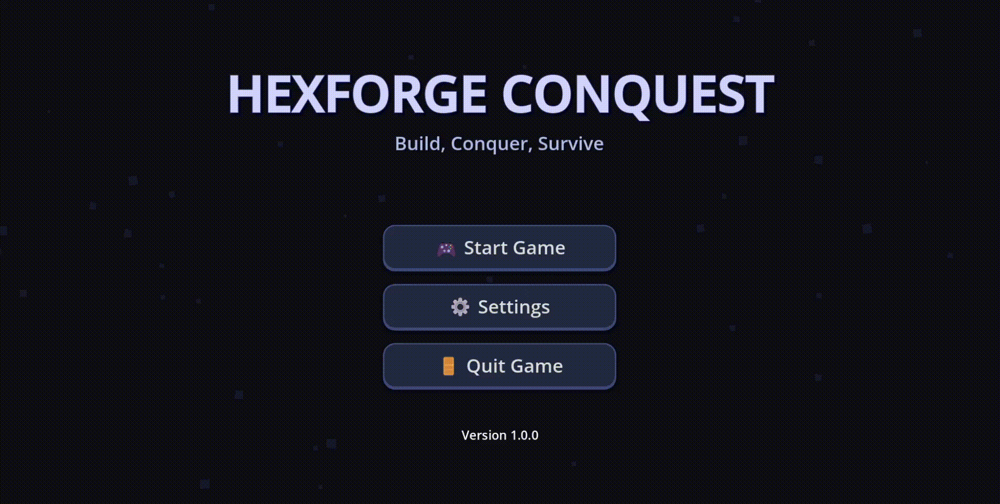

# Hexforge Conquest

A survival strategy game where you explore a medieval hexagon world, gather resources, craft items, and build your base while fighting off enemies.

**[Play on itch.io](https://mntadros.itch.io/hexforge)**

## Features

• Resource gathering and crafting progression  
• Base building with defensive structures  
• PvE combat against AI enemies  
• Medieval hexagon-themed world  
• First-person perspective  

## Controls

**Movement & Actions**  
`WASD` Movement | `Space` Jump | `R` Collect resources | `U` Emergency unstuck  

**Inventory & Menus**  
`1-6` Use inventory items | `ESC` Pause menu  

---

## Assets

• Kaykit Medieval Hexagon Pack  
• Kaykit Dungeon Remastered Pack  

---

**System Requirements:** Windows/Linux, 4GB RAM, DirectX 11  
**Built with Godot 4.4**
